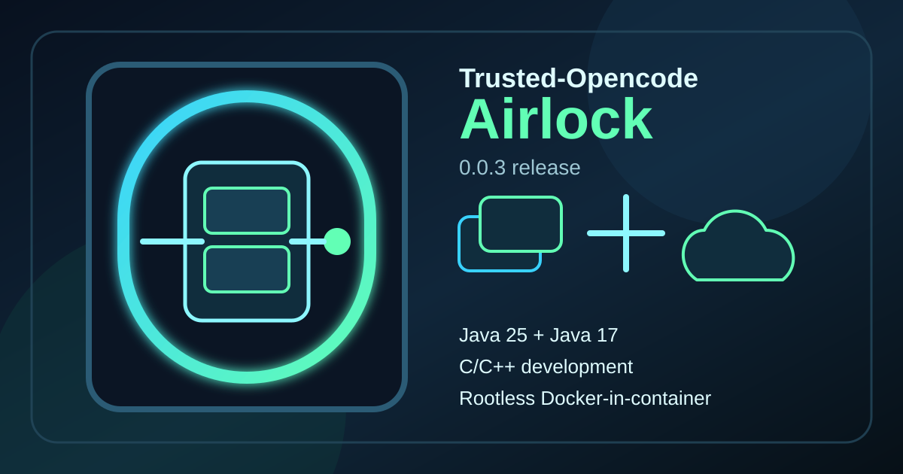
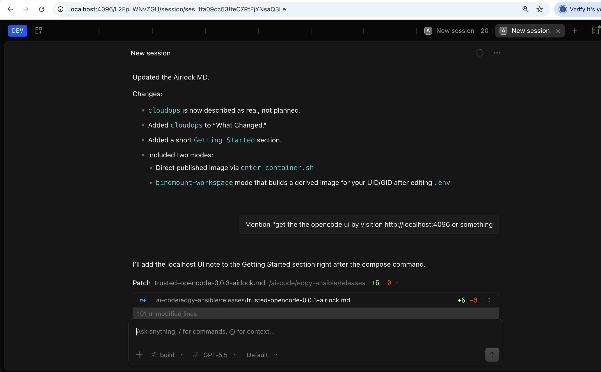

# Trusted-Opencode 0.0.3: Airlock



Trusted-Opencode `0.0.3`, codenamed **Airlock**, is about making opencode a practical isolated build room. It is a container runtime for doing real Java, C/C++, container, and cloud operations work without handing the session the host Docker socket.

## Why Airlock?

An airlock is a controlled boundary. This release keeps that idea: opencode runs inside a container, and when it needs test containers it starts its own rootless Docker daemon inside that boundary instead of escaping to the host daemon.

## What Changed

- Builds opencode from `v1.18.15`.
- Uses the `ecapriolo/jdk-25:0.0.6` Java base images.
- Adds rootless Docker support to the `devel` and `cdevel` opencode variants.
- Adds the `cloudops` variant for Kubernetes and infrastructure workflows.
- Adds `start-rootless-docker` for one-command nested Docker startup.
- Keeps the host Docker socket out of the opencode container.
- Publishes multi-arch `amd64` and `arm64` image tags.

## Image Variants

- `ecapriolo/trusted-opencode:0.0.3-devel`
- `ecapriolo/trusted-opencode:0.0.3-cdevel`
- `ecapriolo/trusted-opencode:0.0.3-minimal`
- `ecapriolo/trusted-opencode:0.0.3-cloudops`

The `cloudops` variant is the cdevel workspace plus cloud-native tools:

- OpenTofu
- Helm
- kubectl
- kind

## Rootless Docker

The `devel` and `cdevel` images include the runtime pieces needed for Docker-in-container:

- Docker CLI and daemon packages
- Buildx
- RootlessKit
- slirp4netns
- fuse-overlayfs
- subordinate UID/GID ranges for `acoder`

Start a container with the repo entry script, then inside it run:

```sh
start-rootless-docker bash
docker run --rm hello-world
```

The verified storage driver is:

```text
fuse-overlayfs
```

## Boundary

Airlock still requires the outer container runtime to provide a few kernel interfaces:

```text
/dev/fuse
/dev/net/tun
systempaths=unconfined
net.ipv4.ip_forward=1
```

Those permissions enable rootless storage and networking for the nested daemon. They do not mount the host Docker socket.

## Goal

The goal is not to make a universal VM replacement. The goal is a reproducible, inspectable, open source opencode workspace that can build software, compile native code, run Java workflows, and launch test containers while keeping the host boundary explicit.

## Getting Started

Run the published image directly when you want the standard container user and a quick isolated workspace:

```sh
cd imaging/opencode
IMAGE_VARIANT=-cdevel sh enter_container.sh
```

Use the bindmount workspace when you want files created by opencode to match your host UID and primary GID:

```sh
cd imaging/opencode/compositions/bindmount-workspace
cp .env.example .env
```

Edit `.env` for your machine:

```text
duid=502
dgid=20
dusername=edward.capriolo
```

Then run:

```sh
docker compose up --build
```

Visit the opencode UI at:

```text
http://localhost:4097
```

Here's how we developed Airlock while peer coding with the previous version:



The compose build creates a small derived image just for your host user, then starts opencode with your bind mounts and rootless Docker runtime settings.
